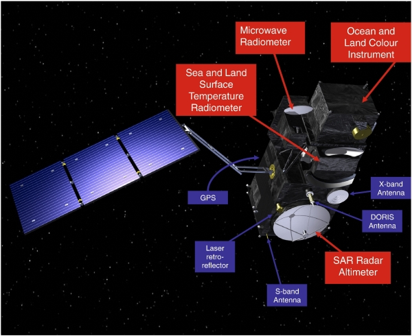
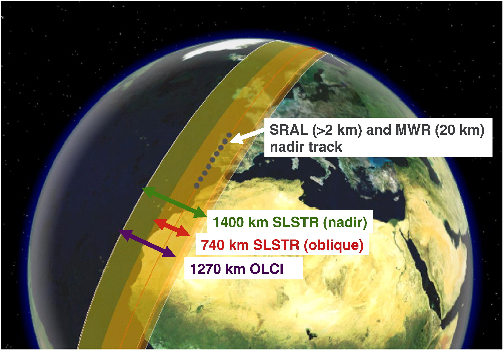
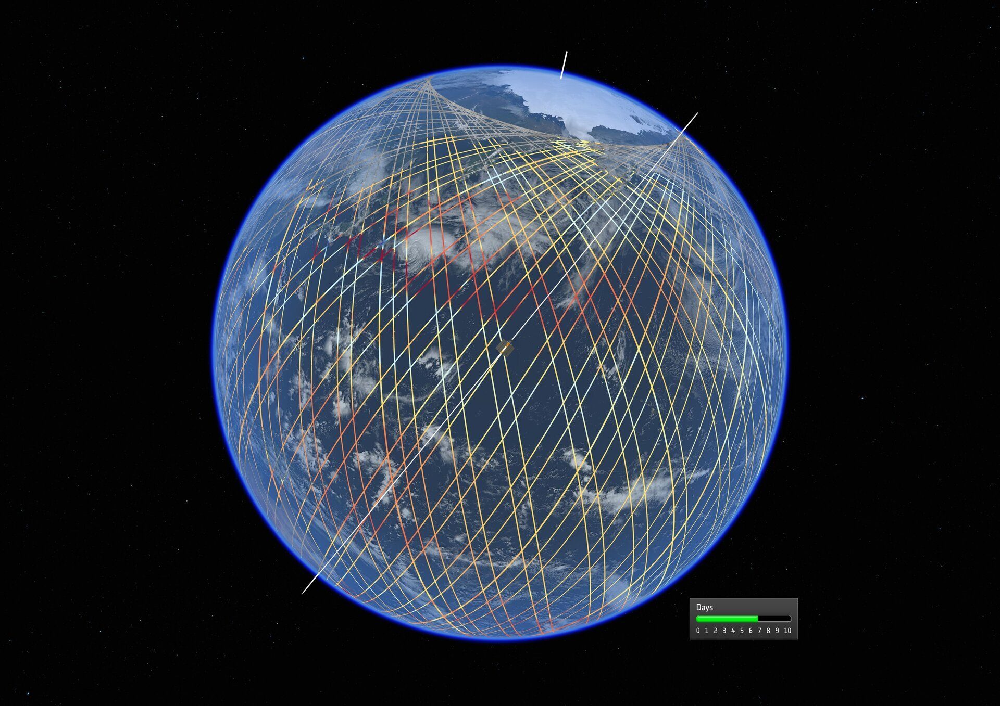

# Easy access Earth observation data for water resource applications

Repo to allow users with little EO (Earth Observation) knowledge to access and download altimetry over reservoirs and lakes for integration into larger water resource projects.

> [!CAUTION]
> rk-altimetry is experimental and under development.
> * The package is expected to be ready for limited use by early 2025

## Installation
> Note: Ensure that `pip` and `git` are installed on your system before running the following command.
```sh
pip install git+https://github.com/DHI/rk-altimetry.git
```
#### Python versions
HydroEO currently runs on Python 3.9 - 3.12.

## How to get started
> Users can find usage examples in the [`notebooks`](./notebooks) directory.

The altimetry project is initialized entirely from information within the provided config file. You can find an example configuration file in `notebooks/example_config.yaml`.
The configuration file includes information on the project directory, reservoir shape file location, gis info as well as credentials for downloading data from various locations. Importantly, this is also where you will specify which satellite products you wish to download and process and for which dates to download. The following will walk you through the different components of the configuration file and explain what is needed when specifying each aspect.


1) General project information

Each project must be initialized with a main directory which is where the processed data and timeseries will be stored. This allows for a previously initialized project to be loaded and updated with new data
```
project :
  main_dir : "C:\\Users\\username\\altimetry_project" # main directory in which to store processed outputs

gis :
  global_crs : 'EPSG:4326'
```

2) Reservoir polygon shapefile

Reservoir information must be provided within a single shapefile that is specified within the config file. A column must be specified in which a waterbodies unique id is provided. The project will automatically process data for all provided polygons.
```
reservoirs :
  path : "C:\\Users\\username\\altimetry_project\\reservoirs.shp" # path to the shapefile holding one or more resevoirs per feature
  id_key : 'project' # the key within the shapefile to the column that holds the unique reservoir ids
```

3) Login credentials for data providers

In order to download data, an account must be made with the appropriate providers. Here you can find information on which providers are needed for each satellite product and how to specify your credentials either in the configuration file or your environment

##### SWOT and ICESat-2
Data provided by NASA (SWOT and ICESat-2) is accessed through the earthaccess python package which allows for easy downloads using your Earth Data Login credentials. You can register for a free Earth Data Login account at [https://urs.earthdata.nasa.gov/](https://urs.earthdata.nasa.gov/). By default, earthaccess will look for your Earth Data Login credentials in a .netrc file, or in environment variables EARTHDATA_USERNAME and EARTHDATA_PASSWORD. If you do not set one of these before running, your credentials must be provided within the config file, which will set the environment variables for you. 
```
earthaccess:
  username : ""
  password : ""
```

If wishing to download SWOT data, reference to the Prior Lake Database (PLD) must be made. If you do not already have a downloaded version, a subset of the PLD will be downloaded from Hydroweb. If you do not have an account already, you should create an account here: [https://hydroweb.next.theia-land.fr/](https://hydroweb.next.theia-land.fr/). Once your account is made, navigate to the User settings and create an API key. Copy this key and add it to the corresponding spot within the config file.
```
hydroweb:
  api_key : "" # you may set the api key directly in the environment rather than in the config file (this helps keep it secret) do so by setting 'EODAG__HYDROWEB_NEXT__AUTH__CREDENTIALS__APIKEY=YOURAPIKEY'
  PLD_path : "C:\\Users\\username\\altimetry_project\\PLD_subset.shp" # path to which the downloaded SWOT PLD file will be saved or loaded from if it already exists
```

##### Sentinel-3 and Sentinel-6
Data provided by ESA (Sentinel 3 and Sentinel 6) is accessed through the copernicus data space. Create a free account here: https://dataspace.copernicus.eu/. Credentials must be provided in the config file directly.
```
creodias:
  username : ""
  password : ""
```

4) Specifying which date and product information

You can choose which products you wish to download and provide specific dates for individual products. You may wish to set a specific location for where to save the raw data. When running the typical workflow, the raw data will be deleted after subsetting to the reservoir boundary. The configuration file for downloading all data would be completed as follows:

```
swot:
  download : True
  process : True
  download_dir : "C:\\Users\\username\\altimetry_project\\data\\swot"
  startdate : [2023, 1, 1] # [year, month, day] format
  enddate   : [2025, 01, 01]

icesat2:
  download : True
  process : True
  download_dir : "C:\\Users\\username\\altimetry_project\\data\\icesat2"
  startdate : [2019, 1, 1] # [year, month, day] format
  enddate   : [2025, 01, 01]

sentinel3:
  download : True
  process : True
  download_dir : "C:\\Users\\username\\altimetry_project\\data\\sentinel3"
  startdate : [2016, 1, 1] # [year, month, day] format
  enddate   : [2025, 01, 01]

sentinel6:
  download : True
  process : True
  download_dir : "C:\\Users\\username\\altimetry_project\\data\\sentinel6"
  startdate : [2021, 1, 1] # [year, month, day] format
  enddate   : [2025, 01, 01]
```

Please see the example configuration file in the notebooks folder for a complete example to download all support products


5) Make your first downloads

Downloading, cleaning and viewing data for your reservoirs can be as simple as a couple lines. See the example notebook for more options and a complete overview.

```
from altimetry.project import Project
altimetry_project = Project(name="my_altimetry_project", config="config.yaml")
altimetry_project.initialize()
altimetry_project.download()
altimetry_project.create_timeseries()
altimetry_project.timeseries_report()
```

## More details into available satellite products
You can find an overview of the different satellites and products support here. It may be helpful to familiarize yourself with mission details and repeat orbits to understand the benefits and shortcomings of each product. Typically it will be beneficial to download data from all available satellites as this will provide the best temporal coverage.

### Surface Water Ocean and Topography (SWOT) mission

### ATLAS/ICESat-2 L3A Inland Water Surface Height (ATL13)

https://science.nasa.gov/wp-content/uploads/2023/06/icesat2-hqprint-print.jpg?w=4096&format=jpeg

ICESat-2 is the second of NASA's "Ice, Cloud, and Land Elevation Satellites" carrying a photon-counting laser altimeter called "ATLAS". While the satellite is originally intended to monitor changes in the cryosphere, it has proven extremely useful for inland water applications. The ATLAS instrument has six beams organized into 3 pairs. The distance between two beams within a pair is 90 meters and 3.3km between pairs. The 6 beam design increases the chances of capturing waterbodies and allows a user to infer the slope of a river reach from the 6 nearby crossing, which proves useful in 1D hydrodynamic modelling (https://www.nature.com/articles/s41597-023-02215-x). Given its intended use, the orbit design for ICESat-2 prioritizes latitudes closer to the poles, meaning that if your area of interest is closer to the equator you can expect a more temporally sparse timeseries for a given crossing. The satellite operates with a repeat cycle of 91 days meaning that you can expect a maximum of 91 days between water surface height observations, though if two orbits cross nearby the target, you can have more frequent observations. 

The ATLAS/ICESat-2 L3A Inland Water Surface Height (ATL13 - https://nsidc.org/data/atl13/versions/6) product provides along-track water surface heights and descriptive statistics for inland water bodies. Inland water bodies include lakes, reservoirs, rivers, bays, estuaries and a 7km near-shore buffer. This product is a good start for the development of an interal altimetry utility because the product is already processed and provides reliable levels without much expert inspection. The downside being the sparse temporal series making its use for creating virtual stations along rivers limited. For more information on this satellite see: https://nsidc.org/data/icesat-2 and https://icesat-2.gsfc.nasa.gov/.

Summary of mission details:
- Dates: October 2018 to present
- Spatial bounds: [N:90 S:-90 E:180 W:-180 degrees]
- Repeat orbit: 91-days
- 6 beams per pass

Example of ground track and beam setup for ICESat-2:

[https://icesat-2.gsfc.nasa.gov/science/specs](https://icesat-2.gsfc.nasa.gov/science/specs)


### Sentinel-3A, 3B

([https://sentiwiki.copernicus.eu/web/s3-mission], Figure 2)(https://sentiwiki.copernicus.eu/web/s3-mission)

ESA's Sentinel-3 satellites carry 3 instruments (OLCI, SLSTR and an altimetry payload) designed to serve a range of applications within the scope of understanding and monitoring global climatic phenomena. Inland water applications rely on the Altimetry Surface Topography Mission (STM) payload, which includes the dual frequency Sentinel-3 Radar Altimeter (SRAL). The altimeter operates by emitting and receiving a single across-track pulse every ca. 2 km.


([https://sentiwiki.copernicus.eu/web/s3-mission], Figure 3)(https://sentiwiki.copernicus.eu/web/s3-mission)

Sentinel 3-A and Sentinel 3-B operate on the same orbit +/- 140 degrees, in order to increase spatial coverage of data. The repeat cycle for both satellites is of 27 days.

Summary of Altimetry Surface Topography Mission details:
- Dates: Sentinel 3-A: 2016 to present, Sentinel 3-B: 2018 to present
- Spatial bounds: [N:90 S:-90 E:180 W:-180 degrees]
- Repeat orbit: 27-days
- 52 km inter-track separation between the two satellites

The sentinel series can therefore provide more temporally dense inland water observations. Currently there is no support for downloading and including this data within virtual stations.


### Sentinel-6

[https://sentinels.copernicus.eu/web/sentinel/missions/sentinel-6/instrument-payload](https://sentinels.copernicus.eu/web/sentinel/missions/sentinel-6/instrument-payload)

The Sentinel-6 mission, also known as the Jason Continuity of Service (Jason-CS) mission, is a collaboration between ESA, NASA, NOAA, and EUMETSAT. The mission's primary objective is to measure sea surface height with high accuracy, but it also provides valuable data for inland water applications. The satellite carries the Poseidon-4 radar altimeter, which operates in a low-resolution mode (LRM) and a synthetic aperture radar mode (SAR). The first satellite, Sentinel-6 Michael Freilich has been launched in November 2020, while the second satellite of the mission is expected to be launched in 2025.

Summary of Sentinel-6 mission details:
- Dates: Sentinel-6 Michael Freilich: November 2020 to present
- Spatial bounds: [N:66 S:-66 E:180 W:-180 degrees]
- Repeat orbit: 10 days
- High-resolution measurements with SAR mode

The Sentinel-6 mission provides high-resolution altimetry data that can be used to monitor inland water bodies, including lakes and reservoirs. The 10-day repeat cycle allows for frequent observations, making it a valuable addition to the suite of satellite products for water resource applications.

Example of ground track for Sentinel-6:

[https://www.esa.int/ESA_Multimedia/Images/2020/11/Copernicus_Sentinel-6_orbital_tracks](https://www.esa.int/ESA_Multimedia/Images/2020/11/Copernicus_Sentinel-6_orbital_tracks)


Combining data from Sentinel-6 with other missions like SWOT, ICESat-2, and Sentinel-3 can enhance the temporal and spatial coverage of water level observations. This multi-mission approach provides a more comprehensive understanding of water dynamics.


## Python development resources
If you're interested in learning more about best practices for developing Python packages, check out the following resources:

- [Python Package Development at DHI](https://dhi.github.io/python-package-development/)
- [Scientific Python Library Development Guide](https://learn.scientific-python.org/development/)
